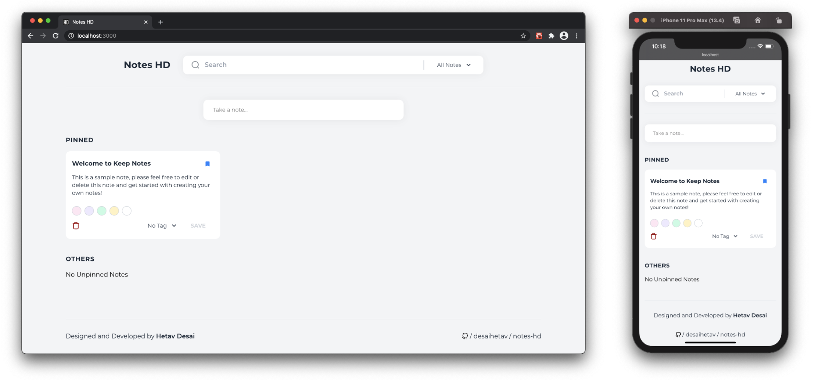

<div align="center">
    <h1>Notes HD</h1>
     <a href="https://app.netlify.com/sites/noteshd-v1/deploys"></a>
    <p>A web application to jot down quick thoughts and organize them using different tags and color codes.</p>
</div>

## Screenshots | [Live Demo](https://noteshd-v1.netlify.app/)
<br/>
<p align="center">
    
</p>

## Technology Stack
- [ReactJS](https://reactjs.org/) (Bootstrapped using create-react-app)
- [TailwindCSS](https://tailwindcss.com/)

## Installation

```
$ git clone https://github.com/desaihetav/notes-hd.git
$ cd notes-hd
$ npm install
```

## Start and Watch
```
$ npm start
```

## Connect With Me
- Twitter – [@desaihetav](https://twitter.com/desaihetav)
- LinkedIn – [Hetav Desai](https://www.linkedin.com/in/desaihetav)